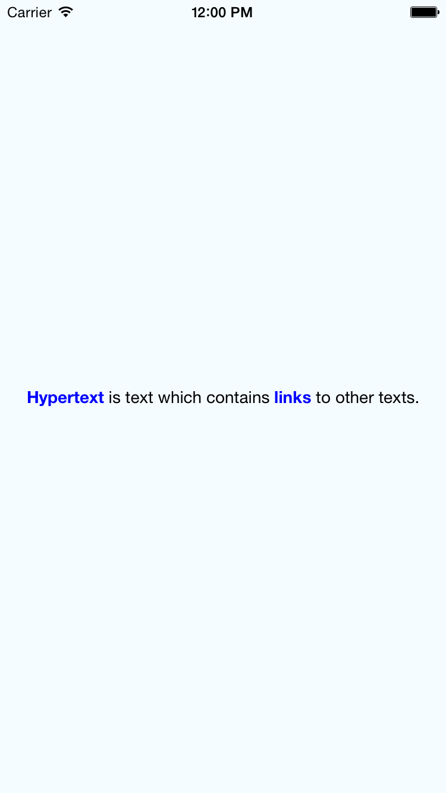

### React Native Hypertext

```jsx
<Hypertext>
  {'<a href="http://www.w3.org/WhatIs.html">Hypertext</a> is text which contains <a href="http://www.w3.org/Terms.html#link">links</a> to other texts.'}
</Hypertext>
```


